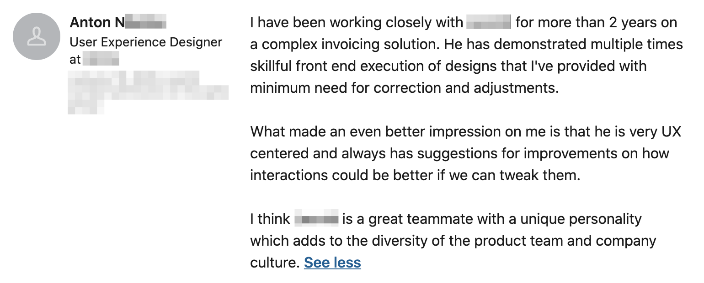
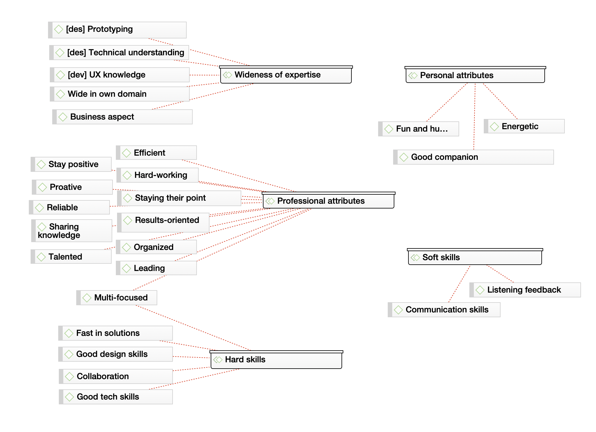

Both User Centered Design (UCD) and Agile Software Development (ASD) are widely used methods in the production of user interfaces (UI). However, they “frequently putting contradictory demands on people working with the respective processes” (Jones, 2019). Trying to match different disciplines, the designers and developers are supposed to conduct alignment work which brings them to mutual understanding in the context of their work, revealing “design breakdowns” (Maudet, Leiva, Beaudouin-Lafon & Mackay 2017) early enough. 
This research aims to find what designers and developers who consider their collaboration process as successful value in each other.

## Research design

To obtain data of what is designers’ and developers’ perceptions of working with each other, the researcher collected recommendations from LinkedIn profiles. For the final data analysis, there were selected profiles of _7 designers_ and _9 developers_. The recommendations were filtered so that for developers it was only recommendations from designers (and not from people with other roles), and for designers it was only recommendations from developers. The roles of the people were taken as they identify themselves in their LinkedIn Profiles.

 
Figure 1.

## Codifying

For the codifying, the data was collected into one document, anonymised and processed with the help of ATLAS.ti. Full text can be found in Appendix 1.

In the text of recommendations, the researcher outlined _1st level concepts_ — the attributes that colleagues highlighted as valuable. The concepts were unified into _themes_ following the area which they belong to. The list of concepts by themes can be found in Appendix 2.

The themes were aggregated into _dimensions_ forming the following scheme.

 
Figure 2.

The dimentions are 1) Wideness of expertise, 2) Hard skills, 3) Professional attributes, 4) Soft skills, and 5) Personal attributes.

Wideness of expertise includes knowledge of the technical aspects for designers, understanding of design (particularly, UX) value for developers and knowledge in the business domain for both roles. Hard skills assume direct role-related knowledge and being good at collaboration. Professional attributes list the properties which contribute into both hard and soft skills. Soft skills are the factors positively affecting communication. Finally, personal attributes ease communication and break the barriers.

## Discussion

The “wideness of expertise” dimension attracts the most. It is noticeable that designers and developers very much value if their colleagues have some knowledge in their area of expertise. These facts resonate with the findings of factors of successful collaboration between UX designers and UI developers. There, the developers complained about “designers do not know enough about the technical limitations when designing solutions” (Jones, 2019). In particular, the developers mentioned that static designs tend “to lack necessary details about the interaction layer in-browser” (Jones, 2019). Similarly, another research mentions the developers’ complaint regarding collaboration with designers as “designers usually don’t take into account the dynamic nature of the data” (Jones, Volker & Gemma, 2016) Generally, the sharing discipline specific knowledge “allows for in-depth discussions about the technical opportunities and constraints of different ideas” (Jones, 2019) and “collaboration is usually smoother when the designer is aware of the developer’s constraints and possibilities” (Maudet et al. 2017) .Correspondingly, the recommendations’ analysis shows that developers value “prototyping” skills of designers which would bring them dynamic designs including the interaction details.

In addition, both designers and developers highlighted business and product knowledge as positive.
This is probably because both designers and developers would like to make mutual decisions regarding the creating product and seeking the missing expertise in their closest colleagues. The value of same-domain expertise can be explained as first the professionals would like to be sure that they can rely on their colleagues' decisions, and for that they validate the colleagues’ knowledge in the area where they themselves are professionals.

Overall research findings complement the studies which outline that “successful collaboration between designers and developers can be found through the following six factors: 1) Close proximity, 2) Early and frequent communication, 3) Shared ideation and problem solving, 4) Crossing over of knowledge and skills, 5) Co-creation and prototyping and 6) Making joint decisions” (Jones & Thoma, 2019).

## Conclusion

The conducted analysis demonstrated correlation with the existing studies. Even though the obtained data was selected randomly and was less than 20 short recommendation texts in total, it allowed to categorize the valuable attributes of designers and developers and showed the match in valuing cross-disciplinary knowledge. The research approach and the method of obtaining data look as a promising contribution into the following study of positive factors for designers’ and developers’ alignment work.

- [Appendix 1. Raw data](./Varya-Stepanova__What-UX-designers-and-UI-developers-value-in-each-other__LinkedIn-study__appendix-1.pdf)
- [Appendix 2. 1st-level concepts and themes](./Varya-Stepanova__What-UX-designers-and-UI-developers-value-in-each-other__LinkedIn-study__appendix-2.pdf)

## References

Jones, Alexander J. 2019. “Factors for Successful Agile Collaboration between UX Designers and Software Developers in a Complex Organisation Item.” Doctoral dissertation, United Kingdom: University of Chester.

Jones, A., & Thoma, V. (2019). Determinants for Successful Agile Collaboration between UX Designers and Software Developers in a Complex Organisation. International Journal of Human-Computer Interaction. https://doi.org/10.1080/10447318.2019.1587856

Jones, A., Thoma, V., & Newell, G. (2016). Collaboration constraints for designers and developers in an agile environment. Proceedings of the 30th International BCS Human Computer Interaction Conference, HCI 2016.

Maudet, Nolwenn, Germán Leiva, Michel Beaudouin-Lafon, and Wendy Mackay. 2017. “Design Breakdowns: Designer-Developer Gaps in Representing and Interpreting Interactive Systems.” In Proceedings of the 2017 ACM Conference on Computer Supported Cooperative Work and Social Computing, 630–41. Portland Oregon USA: ACM. https://doi.org/10.1145/2998181.2998190.
