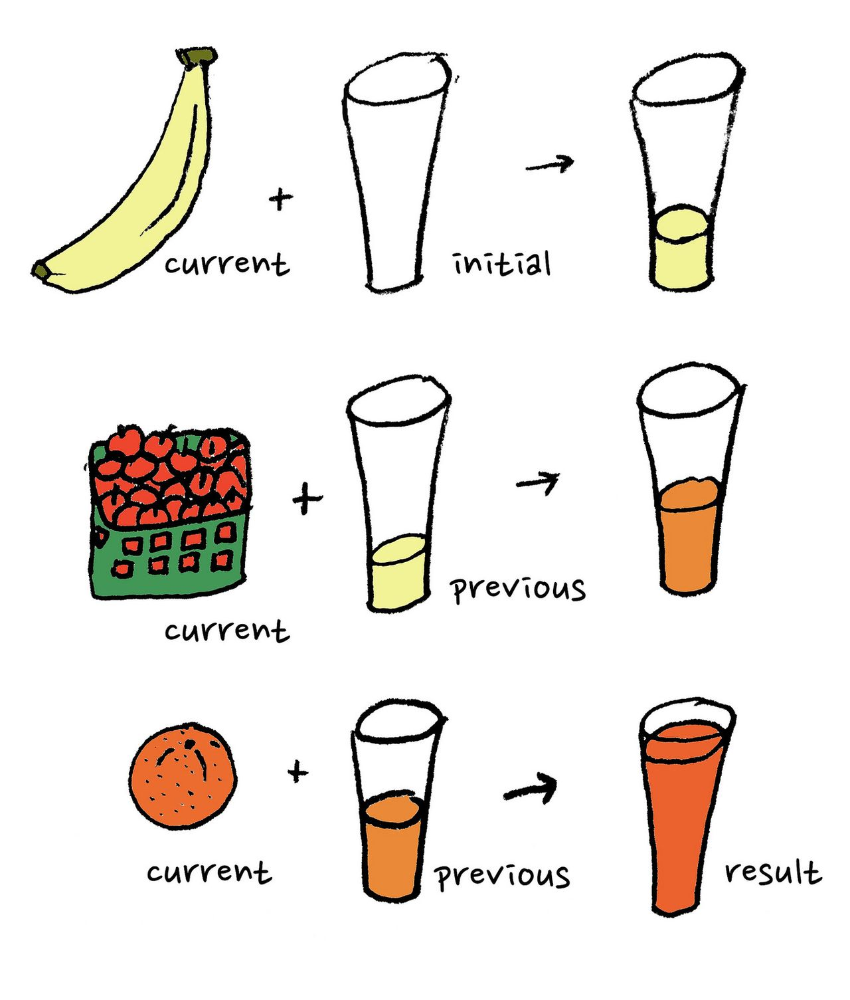

---

title: Flatten array with JavaScript reduce function

date: 2020-06-01
cover: thumb.jpg

layout: post

meta:
desc: >
Javascript reduce function helps to transform data array structures, for example flatten them
into 1-level arrays which are easier to iterate.
---<div data-excerpt>

Nested structures are useful for managing and editing. But when it comes to representation in UI, it might
not be trivial to iterate through all the deep levels. Often happens, that it is more useful to have
a flat structure which probably preserves the depth of the items. In JavaScript, easiest way to transform such structure is
`reduce` method.

</div>

<div class="small" markdown="1">

<br/>
Image source:
[https://macwright.org/2015/01/03/reduce-juice.html](https://macwright.org/2015/01/03/reduce-juice.html)

</div>

Say, we have a nested structure representing the parts of a design system. This is a list of categories
with underlying item which, in turn, may have subitems.

```javascript
export const parts = [
  {
    title: "Visual language",
    parts: [
      {
        title: "Color",
        parts: ["Palettes", "Contrast", "Meaning", "Swatches"],
      },
      {
        title: "Typography",
        parts: ["Hierarchy", "Weights / types", "Web fonts", "Baseline grid"],
      },
      "Photography",
    ],
  },
  {
    title: "UI elements",
    category: true,
    parts: [
      "Paragraph",
      "Block quote",
      "Headers (H1 - H6)",
      "Lists",
      "Links",
      {
        title: "Buttons",
        parts: ["Primary", "Secondary", "Button groups", "Menu buttons"],
      },
      "Slider",
    ],
  },
];
```

Instead of going deeper and deeper, it's worth to flatten the structure with the help of `reduce` function, and then
iterate through the new structure.

```javascript
const flatten = (obj, depth, currentDepth = 0) => {
  const array = Array.isArray(obj) ? obj : [obj];
  return array.reduce((acc, value) => {
    acc.push({
      title: value.title || value,
      depth: currentDepth,
    });
    if (value.parts) {
      acc = acc.concat(flatten(value.parts, depth, currentDepth + 1));
    }
    return acc;
  }, []);
};

const partsFlattened = parts.map((category) => {
  const categoryFlattened = {
    parts: flatten(category.parts),
    title: category.title,
    category: category.category,
  };
  return categoryFlattened;
});
```

This code fallens the given structure as the following.

```javascript
[
  {
    category: "undefined",
    parts: [
      {
        depth: 0,
        title: "Color",
      },
      {
        depth: 1,
        title: "Palettes",
      },
      {
        depth: 1,
        title: "Contrast",
      },
      {
        depth: 1,
        title: "Meaning",
      },
      {
        depth: 1,
        title: "Swatches",
      },
      {
        depth: 0,
        title: "Typography",
      },
      {
        depth: 1,
        title: "Hierarchy",
      },
      {
        depth: 1,
        title: "Weights / types",
      },
      {
        depth: 1,
        title: "Web fonts",
      },
      {
        depth: 1,
        title: "Baseline grid",
      },
      {
        depth: 0,
        title: "Photography",
      },
    ],
    title: "Visual language",
  },
  {
    category: true,
    parts: [
      {
        depth: 0,
        title: "Paragraph",
      },
      {
        depth: 0,
        title: "Block quote",
      },
      {
        depth: 0,
        title: "Headers (H1 - H6)",
      },
      {
        depth: 0,
        title: "Lists",
      },
      {
        depth: 0,
        title: "Links",
      },
      {
        depth: 0,
        title: "Buttons",
      },
      {
        depth: 1,
        title: "Primary",
      },
      {
        depth: 1,
        title: "Secondary",
      },
      {
        depth: 1,
        title: "Button groups",
      },
      {
        depth: 1,
        title: "Menu buttons",
      },
      {
        depth: 0,
        title: "Slider",
      },
    ],
    title: "UI elements",
  },
];
```

Lately, the flat structure can be used if, for instance, you need to output the items similarly but
provide additional CSS classes depending on the depth of the items. [Run the demo](https://jsfiddle.net/1ew8gn63/15/)
to see how it can work.
