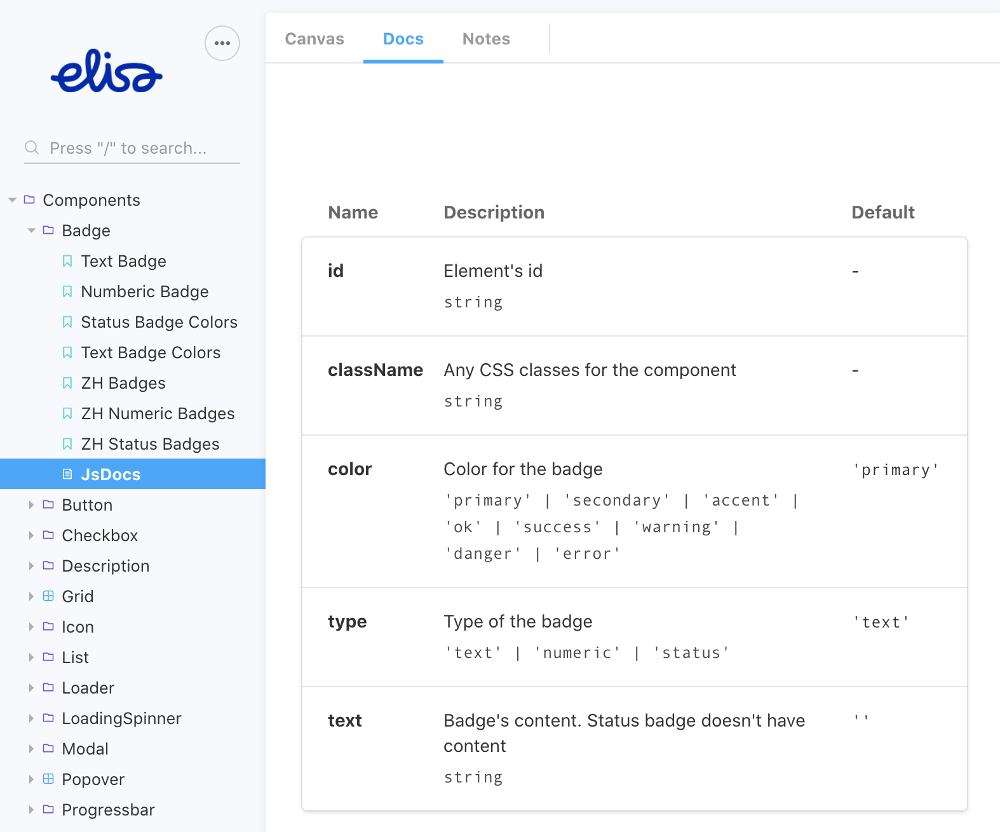
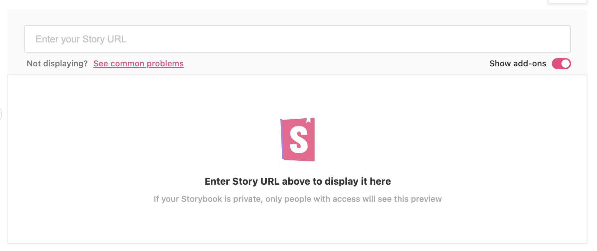
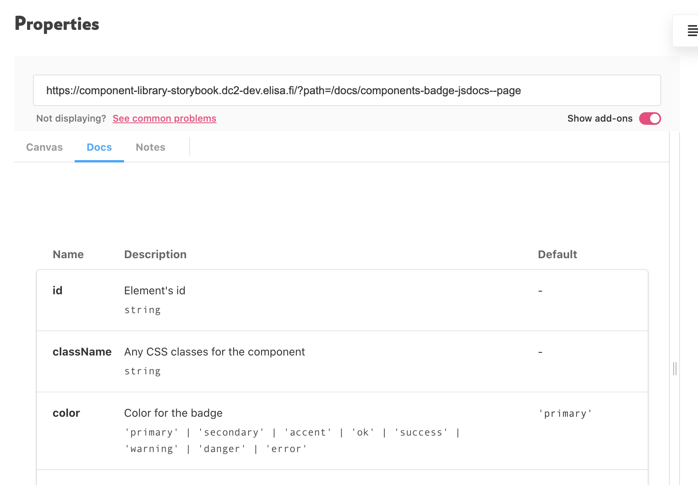
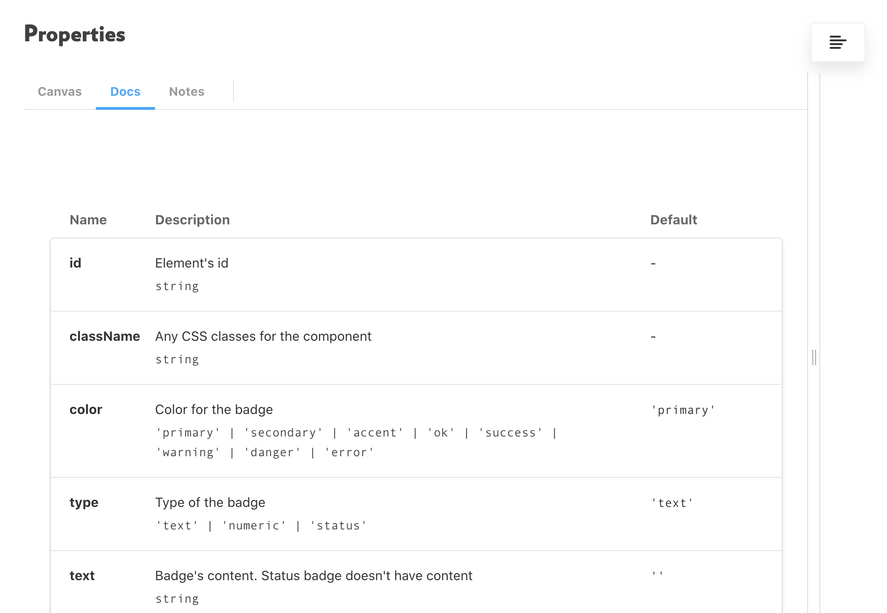

---

title: PropTypes documentation in ZeroHeight

date: 2020-06-16
cover: thumb.jpg

layout: post

meta:
  desc: >
    Detailed instruction on how to output the PropTypes table for a component in ZeroHeight and so
    keep your design system documentation up-to-date from both design and development perspectives.


---

<div data-excerpt>

One of the main focuses in my recent work is to keep documentation for designers and developers
in the same place. How exactly to achieve this, depends on what are the chosen documenting tools.
At the moment, our team is trying ZeroHeight which is very much appreciated by the designers. However,
brining there technical documentation like a PropTypes table for the components, I faced some obstacles.
Anyways, there is a solution.

</div>

### Create a Storybook page with PropTypes table

For every component, create a separate page in Storybook where you output only the component properties. You can use `MDX` syntax for stories. So, `Components.stories.mdx` (or another name, depending on your Storybook configuration) should contain the following code.

```javascript
import { Meta, Props } from "@storybook/addon-docs/blocks";
import Badge from "./Badge.js";

<Meta title="Components/Badge/JsDocs" component={Badge} />

<Props of={Badge} />
```

This renders you the page like in the screenshot below.

<div class="small" markdown="1">

<br/>
Source:
[Elisa Design System. Badge component](https://component-library-storybook.dc2-dev.elisa.fi/?path=/docs/components-badge-jsdocs--page)

</div>

### Embed the PropTypes page into ZeroHeight

1. On the component page in ZeroHeight, insert a new block of code.
   
1. Select the "Storybook" option.
   
1. Turn on "Show add-ons" and insert the URL of the PropTypes page from your Storybook.
   

Once the page is loaded, you get a result similar to this:




## Result

In the view mode, you can see cleaner output without the URL of the page.



Unfortunately, there is no way to make PropTypes shown automatically for all the documented components. Even though,
you can automate creating separate PropTypes pages in your Storybook, brining the resultant URLs into ZeroHeight still
will be manual work. Also, the page is rendered in an iframe that does not detect the height of the content. Mostly,
while JsDoc updates and the amount of properties changes, you will have an either too long iframe with an extra space or
too short iframe with a scroll.

Nevertheless, the need to keep documentation for designers and developers in the same place, makes me put up with these
obstacles and inaccuracies. In my current project, I will continue using this solution until and if better integration options
appear.