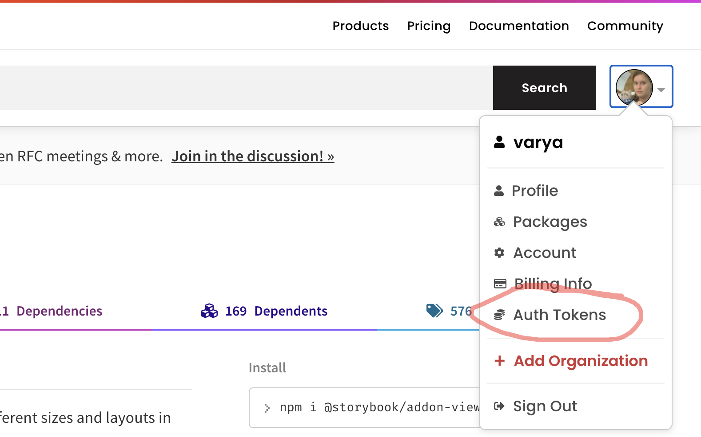
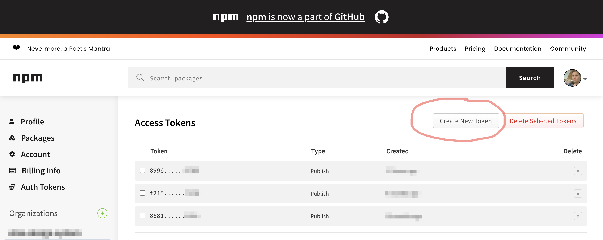
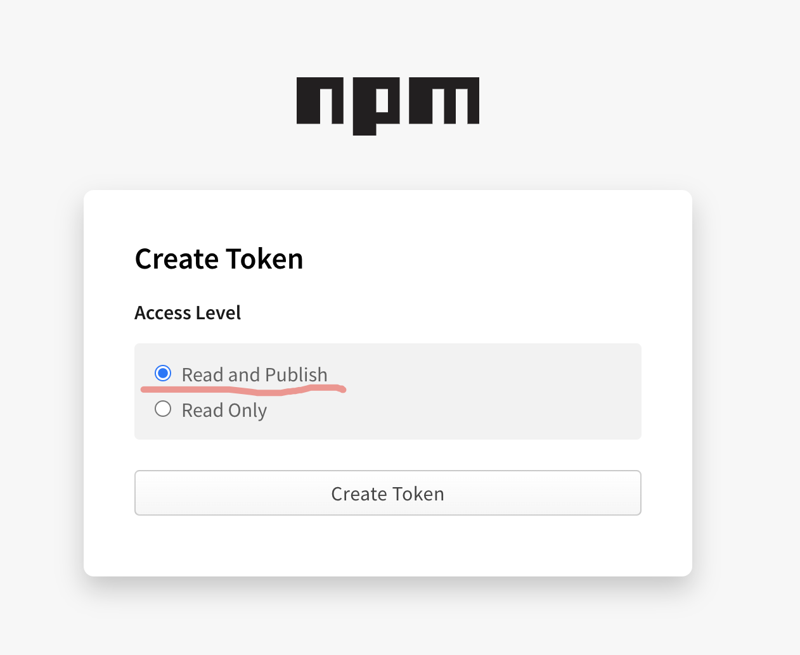
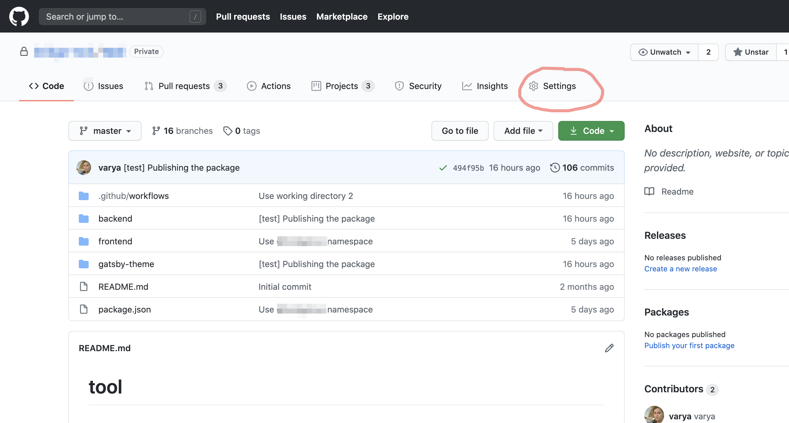
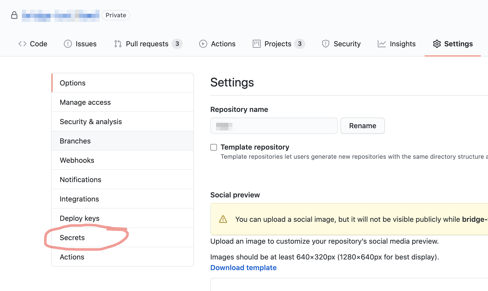
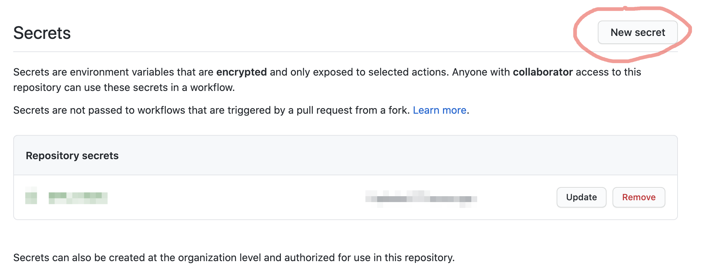
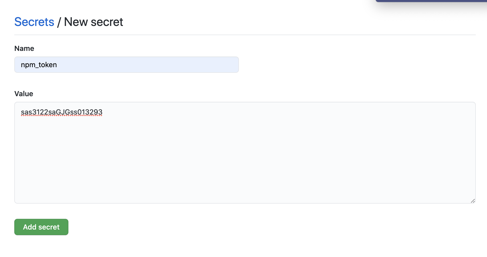
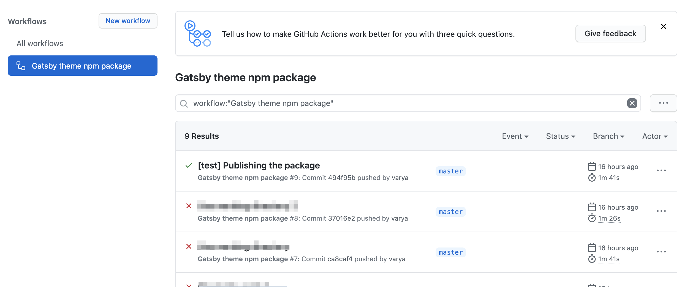

---

title: Automatic releases of npm packages with GitHub actions

date: 2020-08-17
cover: thumb.png

layout: post

meta:
  desc: >
    How to tune GitHub workflows for automatic releases of an npm package. The npm publish
    can be run on every change to the master branch keeping your npm package up-to-date
    with its repository.

---

<div data-excerpt>

Recently I implemented a new cool feature to one of the npm packages I develop. Later this day, I was
showing it to a friend, and ... nothing worked. What a shame, I forgot to publish the package. The
feature successfully passed the tests, and was pushed to the package GitHub repository but no one could not
enjoy it anyway. Is there anything to help to avoid such situations? Yes, it is [GitHub Actions](https://github.com/features/actions) — automated workflows that can run different jobs, including publishing packages to npm.

</div>

Setting up a workflow is surprisingly simple: you only need to create a `.yml` file in `.github/workflows` folder. A file could
have any name as there can be more than one workflow.

Here is the content of my `.github/workflow/gatsby-theme-npm-publish.yml`

```yml
name: Gatsby theme npm package

on:
  push:
    branches:
      - master

jobs:
  publish-npm:
    runs-on: ubuntu-latest
    env:
      working-directory: ./gatsby-theme
    steps:
      - uses: actions/checkout@v2
      - uses: actions/setup-node@v1
        with:
          node-version: 12
          registry-url: https://registry.npmjs.org/
      - run: npm install -g yarn
      - name: install packages
        run: yarn
        working-directory: ${{env.working-directory}}
      - name: publish
        run: npm publish
        working-directory: ${{env.working-directory}}
        env:
          NODE_AUTH_TOKEN: ${{secrets.npm_token}}
```

As you can see, the jobs run on every push to the `master` branch. There are a couple of special details in this workflow.

Note that the package build is made not in the root directory but in the `gatsby-theme` directory. This repository hosts several packages, this is why. To run the commands in the correct context, I had to specify the directory. For that, I first define the `working-directory` variable in the `env` section of the job and later use it az `${{env.working-directory}}`.

Another detail is providing an authorization token for npm. Such tokens are to generate on the [https://www.npmjs.com/](https://www.npmjs.com/) website:



Click on the **Create new token** button.



And choose to create a token with the right to publish.



Copy the token you got into the clipboard.

After that, you need to add this token to the secrets of your repository. Go to the **Settings** tab of the repository:



Find the **Secrets** page in the sidebar.



Create a new secret.



Put the npm token which you have in the clipboard to the texarea and give it a name, say `npm_token`.



This name is what has to be provided as a value of `NODE_AUTH_TOKEN` variable in the `env` section of
the `npm publish` command.

```
NODE_AUTH_TOKEN: ${{secrets.npm_token}}
```

Voilà! Now I have the npm package automatically published every time the `master` branch is updated.

