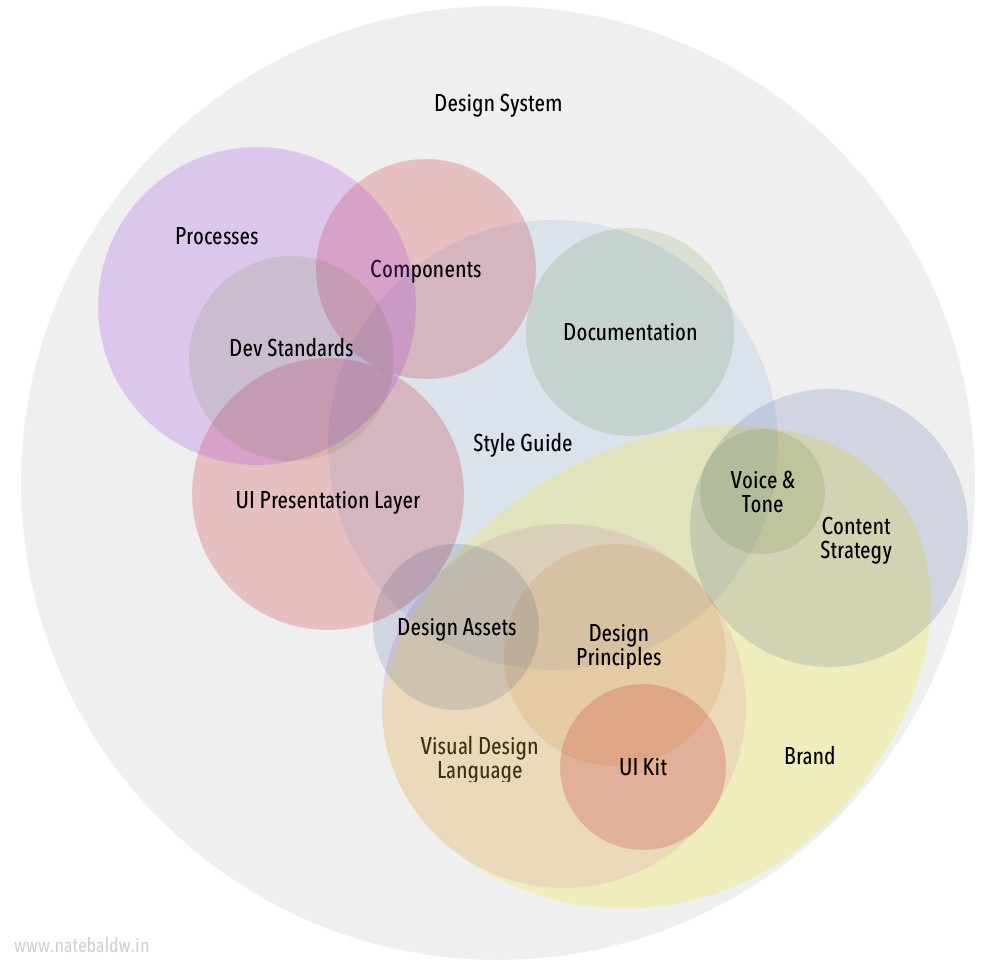
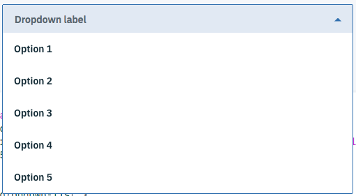
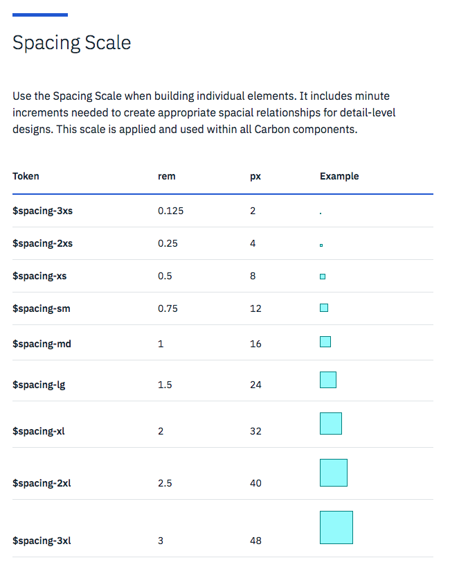
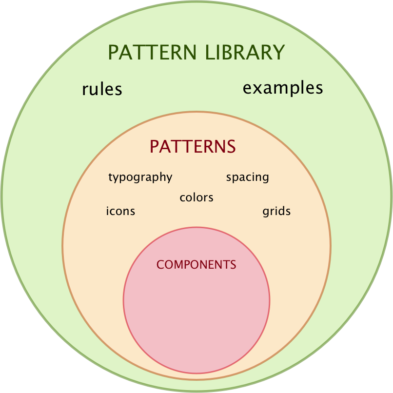
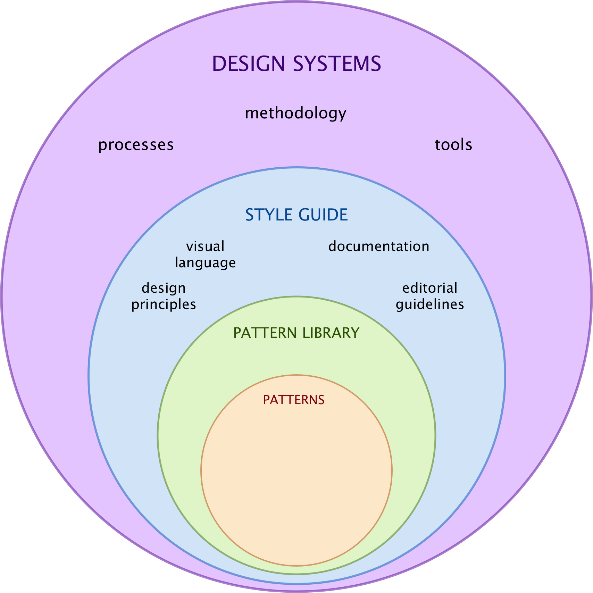

## Introduction

In general, _design systems_ is a systematic approach to creating and maintaining consistent user interfaces which
coherently communicate the brand values and empower user experience.

Similarly to physical things, such as sewing a dress, a web application can be created not in a factory but by an
amateur. To do this, a person certainly needs some skills but a systematic approach can be out of use. The situation
changes if the volume of the subject increases up to the industrial level. In the same manner, when developing and
maintaining larger websites, in the long run, there is a need of methods and tooling which ensure the quality of the
output and consistency of elements across different items, decrease the costs of the production and empower in-team and
cross-teams collaboration. In programming and management, such systematic approaches are actively produced and adopted
by the web community. Currently, similar methodologies are being created for the design part.

Design systems are meant to standardise and simplify the process of interface design and development, they bring new
approaches and form their own ecosystem. Currently, design systems are a separate domain in the area of making web and
mobile applications, they are interesting to apply in practice and study from a scientific perspective. However, there
is no solid understanding of the concepts and terms forming the design systems. This issue has already been addressed in
the professional literature. For example, Alla Kholmatova outlines that “there isn’t a standard definition of “design
system” within the web community, and people use the term in different ways” (Kholmatova, 2017). Moreover, the specific
entities, which form the design system concept, are often understood in different ways. Sometimes, authors even use the
same term to address different subclasses. Such inconsistency in terms makes “hard for newcomers and experts alike to
get the crux of the problems we are solving” (Federman, 2017).

To solve the term inconsistency and provide structured professional language, this article focuses on the vocabulary
used in the design systems domain by observing a range of materials on the topic, from both academic and popular
sources. By categorizing and summarizing information in the selected materials, the article outlines the key concept of
design systems in the context of user interface development, introduces the main entities and observes their different
interpretations in the literature. Based on the summary of these interpretations, the design system sub-concepts are
organized into a hierarchical schema and are given most suitable names.

## Material selection and methods

This review article observes both popular and academic sources related to the topic. Academic sources were selected by
their relevance to User Interface Design domain and by presence of keywords “pattern”, “style guide” and overall
applicability. Popular sources were selected from highly cited public articles and blog posts by authors who often speak
on the topic at professional conferences or frequently publish materials related to the topic. These popular sources
also include articles and blog posts which try to provide their own categorisation and outline the building blocks of
the concept.

The gathered materials were examined on the presence and description of concepts and sub-concepts related to the design
systems. Their representation is categorised and summarised below.

## Problems to solve

In the design for the web, the following problems occur most frequently:

1. Inconsistent user interfaces
1. Large costs of design
1. Low-level multidisciplinary collaboration
1. Non-efficient design-team work

### 1. Inconsistent user interfaces

It still often happens that user interface (UI) elements are not consistent across some websites or applications. There
are multiple reasons behind that, such as 1) similar elements being created by different designers and developers
experiencing lack of in-team communication, or 2) the same elements being implemented more than one time, sometimes even
by the same person, because of lack of documentation for existing solutions, or 3) new design solutions being made
without aligning with existing ones, and many other reasons. All of those lead to badly done websites and applications
which fail to communicate the brand and provide a good user experience.

### 2. Large costs of design

Mostly, the reason for user interface inconsistency mentioned above is creating same or
similar things again and again without references to the work already done. Besides bad results, it also costs a lot.

### 3. Low-level multidisciplinary collaboration

Web products are created by multidisciplinary teams which include
designers, developers, copywriters, managers, etc. On one hand, they all are working on the same product. On the other
hand, each of these disciplines has its own fashion barely interconnected with the others. To achieve a good level of
collaboration, such team needs to follow special working approaches and use appropriate and efficient tooling.

### 4. Non-efficient design-team work

In larger products, many designers work on the same product. This case brings the
collaboration problem even down to a single-disciplinary team. This becomes especially visible on the scale. Rapidly
growing companies need to scale their design teams fastly and even place them in multiple locations. Ensuring the design
consistency and quality when experiencing such growth is a great challenge. At the same time, the products themselves
have to be created “in a scalable and repeatable way” (Saarinen, 2016).

## 1. The concept of design systems

Design systems is a systematic approach that offers solutions to the problems presented above.

Since design systems are a yet evolving concept, the sources use different terms when addressing them. Some authors tend
to observe design systems from a perspective of a technical solution and interpret them as collections of reusable UI
components:

“A design system is a collection of reusable components, guided by clear standards, that can be assembled together to
build any number of applications.” (Fanguy, 2017) “A design system is a collection of reusable components to tie whole
products together” (Baskanderi, 2018)

At the same time, other authors call such collections “component
libraries” or “pattern libraries” and describe them only as a part of a design
system. They interpret the design systems concept as more complex but have
difficulties to give a straightforward definition for them. Saarinen (2016)
focuses on the processes formed by design systems: “design systems are more
systematic ways to guide and leverage our collective efforts” (Saarinen, 2016). Braga partly supports this interpretation but also makes it wider by
including the tools: “Design systems are basically a combination of tools and
processes that will help our teams working better together” (Braga, 2017).
Authors of the iconic “Design Systems Handbook” introduce a design system
through its function saying that it “unites product teams around a common
visual language” (Suarez, Anne, Sylor-Miller, Mounter, and Stanfield, 2017).
Thus, they see design systems as a set of approaches for collaborative work,
design tools for providing user-friendly and brand-supportive interfaces, sets
of methods and frameworks to bridge the gap between design and development and
practical solutions for saving the costs.

The wide interpretation of design systems includes some sub concepts; together
they build a whole ecosystem. There have already been attempts to outline the
ecosystem as a schema but due to lack of consistency in terms, the schemas by
different authors vary.

Zack Rutherford (2017) proposes a well-structured scheme (Figure 1) with a
clear hierarchy and no interconnections. The scheme defines such subclasses as
“building blocks”, “pattern library”, “rules” and “style guide”. Each of these
subclasses contains a set of terms.

 “The structure of a Design System”.;credit=UXpin;creditLink=https://www.uxpin.com/studio/blog/design-systems-vs-pattern-libraries-vs-style-guides-whats-difference/)

Jan Toman (2017) draws a different scheme (Figure 2). Besides altered
structure, this scheme also uses the different words to name its components. In
here, the word “block” is used as a synonym for “UI component”, the library of
them is called “component library” (not “pattern library” as Rutherford (2017)
proposes), and “styleguide” does not include the library but is connected to
it.

 The Design System Schema.;credit=Source;creditLink=https://product-unicorn.com/design-systems-style-guides-all-those-libraries-what-the-hell-is-the-difference-4c2741193fdc)

Nate Baldwin (2016) provides the schema (Figure 3) with many intersections and includes additional components such as
“development standards” and “processes”.

 
Figure 3. Nate Baldwin (2016) Design System Schema. 
Source: https://blog.producthive.org/anatomy-of-a-design-system-7a6b0677bf5

In many other sources, authors do not provide schemas but operate the terms.
This article introduces these sub-concepts and their naming, summarize them to
represent as building blocks of one bigger system and explain their
contribution into the UI developing current problems.

## 2. Blocks of a design system

### 2.1 Component

The _component_ is the most solid term of the design systems concept. It
originates from the development field and has the most univocal meaning.
Multiple authors define a component from the implementation perspective, as
“portion of reusable code, serving as building blocks for the application
interface” (Suarez, Anne, Sylor-Miller, Mounter, and Stanfield, 2017).
Important to note that represented as pieces of code, components encapsulate a
standalone entity that is meaningful on its own. They can be nested and
interact with each other, but semantically they remain equal.

From a user perspective, components are meaningful elements of a web
application, for example, buttons, form inputs, dropdowns. Figure 4
demonstrates a dropdown as an example.

 
Figure 4. Example of a component — dropdown UI element. Carbon Design System for IBM Cloud products. 
Source: http://carbondesignsystem.com/components/dropdown/code

 
Figure 5. Components.

### 2.2 Pattern

Not all the design solutions can be technically implemented as components. Some
of them play as properties of many components, for example, paddings, colors,
typography, and motions.

Academic literature uses the term pattern to address these standalone design
solutions. This way, Granlund, Lafrenière, and Carr (2001) write that patterns
“describe generic solutions to common problems in context” (Granlund,
Lafrenière and Carr, 2001). However, they later limit this wide definition
saying that a pattern should be a “formalized description of a proven concept
that expresses non-trivial solutions to a UI design problem” (Granlund,
Lafrenière and Carr, 2001). This defines a pattern wider than a component but
keeps it as something specific and objective. This view is supported in popular
literature by Lopes (2017), who says that “foundational elements like defined
text styles for headers and content, a colour palette, inputs, forms, what we
call patterns and components” (Lopes, 2017).

Figures 6 and 7 demonstrate how a pattern can look for a designer. The exact
representation may vary depending on the design system technical
implementation.

 
Figure 6. Example of a color pattern. Carbon Design System for IBM Cloud products. 
Source: http://carbondesignsystem.com/style/color/swatches

 
Figure 7. Example of a Spacing pattern. Carbon Design System for IBM Cloud products. 
Source: http://carbondesignsystem.com/style/spacing

Some authors use the term “pattern” when speaking about components. However,
they still face the need to distinguish solutions for repeatable UI elements
and more general ones. One of such authors, Alla Kholmatova (2017) introduces
_functional patterns_ as “tangible building blocks of the interface” (Kholmatova, 2017) and
_perceptual patterns_, which she does not define but provides examples
such as “tone of voice, typography, color palette, layouts, illustrations and
iconography styles, shapes and textures, spacing, imagery, interactions or
animations, and all the specific ways in which those elements are combined and
used in an interface” (Kholmatova, 2017).

Assuming the frequency of using the term “pattern” as a wide definition for a
specific user interface solution and the term “component” as code
representation of such pattern, this naming seems to be the most suitable to
keep further.

 
Figure 8. Patterns.

### 2.3 Component library

As described above, a component solves a specific design problem by providing a
piece of code for rendering a specific functioning UI element, or a set of
related elements. In a regular website, there are multiple components in use.
Even a simple page with a plain form would contain different types of input
elements, a submit button and supportive texts. Each of those entities is a
separate component.

To ensure the reuse of components, they should be represented as a set. Such
set is usually called “component library” and is meant to provide
implementations for design solutions of the same system.

In the literature, such sets of components are sometimes also called “pattern
libraries” and even “design systems”. For example, Fanguy (2017) writes that “a
design system is a collection of reusable components, guided by clear
standards, that can be assembled together to build any number of applications”
(Fanguy, 2017).

### 2.4 Pattern library

However, many authors define pattern libraries otherwise than component
libraries, based on the difference between component and pattern explained
above. This way, a pattern library is “a subclass in the design system, this is
the set of design patterns for use across a company” (Rutherford, 2017).

Similarly to component libraries being collections of components, pattern
libraries are collections of patterns. However, due to more abstract nature of
patterns, it is harder to visualize such collections.

Ste Grainer (2017) gives a comprehensive explanation of pattern libraries
through their attributes. According to him, pattern libraries contain UI
components as representations of some patterns and also define use cases and
provide relations between the patterns (Grainer, 2017). This way, the
perceptual patterns can be represented by their description, examples of usage
and their connections to the other patterns.

Assuming the nature of perceptual patterns the difference between a component
library and a pattern library can be identified by the presence of their
interconnections and rules of usage. Marco Lopes supports this point of view
when describing the process of creating the pattern library: “break down an
interface into reusable building blocks, arrange and group them, name them,
establish rules between them, generate an overview of all components, and make
them available for the entire team to build and design with” (Lopes, 2017).

 
Figure 9. Pattern library.

### 2.5 Visual language

Both pattern libraries and component libraries ensure the reuse of the design
solutions and this way increase consistency across the product. However, on the
web, the products are constantly being developed and through time they need new
designs. Similarly to how existing design solutions ideally form a solid
system, new designs should fit into this system and extend but not break its
consistency. To achieve that, designers have to align their new designs with
the existing ones.

The designers can provide new solutions, consistent to the others, in the
amateur fashion making them by analogy with the old ones. However, on the
industry level, producing adequate design solutions requires special methods
and tooling. In the design systems concept, the is a subclass serving for this
purposes. It is called a _visual language_.

The following content forms visual language:

- Design principles. 
  They define the core value of the product and team.
- Best practices. 
  Outline the best methods to be used for achieving the team goals.
- Specifications.

Unlike the pattern libraries which instruct what are the patterns to form a
good product, visual language also articulates why these patterns should be
used (Robson, 2016). The Design Systems Handbook names visual language “a core
part of [...]{.zero} design standards” (Suarez, Anne, Sylor-Miller, Mounter, and
Stanfield, 2017) which ensures user experience and empowers the components not
only provide specific designs but also “play an integral role in expressing the
personality of your brand” (Suarez, Anne, Sylor-Miller, Mounter, and Stanfield, 2017). Visual language helps to make a step from static rules and individual
solutions towards evolving ecosystem (Saarinen, 2016).

### 2.6 Style guide

Well documented pattern library and visual language, accompanied by additional
attributes such as editorial instructions, form a _style guide_. A style guide is
an internal company website which “represents the styles, patterns, practices,
and principles of a design system and teaches how to use it” (Grainer, 2017).
Such a website contains “static documentation which describes the design system
itself: how products should look and feel, use cases for UI patterns, correct
typographic scales, etc” (Rutherford, 2017). In other words, the presence of
visual language description makes the style guide different from a plain
pattern library documentation.

The shared characteristic of the style guide elements is that they all guide
towards a great product. This view is supported by academic sources that define
style guides as “a form of standard that assists in managing the development
process, including addressing inconsistency” (Simpson, 1999). Thus, the style
guide elements work each on its level: pattern library provides ready-made
design solutions (components and perceptual patterns) for reuse, visual
language ensures consistency of upcoming solutions, writing guidelines help to
compose texts for the product, technical code style ensures the quality of the
code forming the product. Besides listed elements, a style guide may (or may
not) include others in accord with the needs of the product.

 
Figure 10. Style guide.

### 2.7 Design system

Design systems defined as “a combination of tools and processes” (Braga, 2017)
contain style guides and their inner elements. Besides, they outline the
processes of using these tools to achieve the final goals. This view introduces
design systems as a methodology which transforms the design process similar to
how agile approach transformed the development process (Federman, 2017).

To conclude, design systems are “the methods by which you design products”
(Federman, 2017). This includes “objective aspects” such as specific design
solutions implemented as components and documented patterns which communicate
decisions and reasoning behind the solutions via a style guide. Other,
“abstract aspects” contain strategies for effective collaboration in
multidisciplinary teams and processes established for the team activities.

 
Figure 11. Design systems.

## 3. Value of design systems

Design systems and their active usage in the design and development process
bring value to several different levels.

Since design systems ensure consistency of interfaces and coherency of design
across a whole application or a range of one-brand products, they bring value
to a user by increasing their productivity and effectiveness when working with
a web application (Simpson, 1999 & Saarinen, 2016).

From the management perspective, design systems provide “lingua franca” — a
shared language to be used and help with in-team and cross-teams collaboration.
In the teams that adopt design systems, meetings tend to be shorter and more
productive (Grundhoefer, 2016). Usage of design systems also makes “work
smarter not harder” (Grundhoefer, 2016) so that suitable design can be provided
and implemented the first time and not through many iterations.

For the developers, component libraries as elements of design systems ensure
code reuse and thus increase the overall quality of the product. They also
reduce the time needed for implementing new designs.

For the designers, design systems define the skeleton of the work on both
abstract and practical levels. They give tools and processes for systematic
design, ensure design coherency, serve for documenting design solutions,
guarantee end quality of design implementation and make possible to focus on
_solving business problems_.

## Conclusion

This article observed the representation of the concept of design systems in
academic and popular sources. It demonstrated the large inconsistency of the
terms used in the domain, summarized and explained the subconcepts introduced
by different authors. According to this summary, design systems are a
methodological concept which includes effective teams processes and tooling.
They contain visual language, documentation, patterns, and components in their
libraries and a major of guidelines.

The value of design systems, proven and outlined by many authors, was
represented from different perspectives: of a user, of a manager, of a
developer and of a designer.

As a yet evolving concept, design systems can change their shape in near
future. In this regard, the provided summary is not final and requires
re-visiting if new interpretations appear. However, at the moment, it seems
more interesting to elaborate on the nature of design systems building blocks
and study their practical application by different teams working on different
products.

## References

Baldwin, N. (2016). Anatomy of a Design System. Product Hive online blog. [online]{.zero} Available at: https://blog.producthive.org/anatomy-of-a-design-system-7a6b0677bf5 [Accessed 27 March 2018]{.zero}.

Baskanderi, N. (2018). How to Build a Design System with a Small Team. freeCodeCamp, online community. [online]{.zero} Available at: https://medium.freecodecamp.org/how-to-build-a-design-system-with-a-small-team-53a3276d44ac [Accessed 27 March 2018]{.zero}.

Braga, G. (2017). Pattern library, Style guides, Design Systems. Do you need one? Prototypr online blog. [online]{.zero} Available at: https://blog.prototypr.io/pattern-library-style-guides-design-systems-do-you-need-one-b7857af0f255 [Accessed 27 March 2018]{.zero}.

Carbon Design System for IBM Cloud products (2018). [online]{.zero} Available at: http://carbondesignsystem.com/ [Accessed 27 March 2018]{.zero}.

Fanguy, W. (2017). A comprehensive guide to design systems. InVision design blog. [online]{.zero} Available at: https://www.invisionapp.com/blog/guide-to-design-systems/ [Accessed 27 March 2018]{.zero}.

Federman, S. (2017). Distilling How We Think About Design Systems. Design Systems Publications. [online]{.zero} Available at: https://publication.design.systems/distilling-how-we-think-about-design-systems-b26432eefef9 [Accessed 27 March 2018]{.zero}.

Grainer, S. (2017). Design Systems, Style Guides, and Pattern Libraries: Oh My! UXcellence journal. [online]{.zero} Available at: https://uxcellence.com/2017/design-systems-style-guides-pattern-libraries [Accessed 27 March 2018]{.zero}.

Granlund., Å, Lafrenière D. and Carr, D. (2001). A Pattern-Supported Approach to the User Interface Design Process. Proceedings of HCI International 2001 9th International Conference on Human-Computer Interaction, August 5-10, 2001, New Orleans, USA.

Grundhoefer, A. (2016). Design Systems: Enterprise UX Evolution. [online]{.zero} Available at: https://speakerdeck.com/annegrundhoefer/design-systems-enterprise-ux-evolution [Accessed 27 March 2018]{.zero}.

Kholmatova, A. (2017). Design Systems. A practical guide to creating design languages for digital products. Freiburg, Germany: Smashing Media AG.

Lopes, M. (2017). Setup a design system. Prototypr online blog. [online]{.zero} Available at: https://blog.prototypr.io/design-system-ac88c6740f53 [Accessed 27 March 2018]{.zero}.

Robson, S. (2016). Styleguides, Pattern Libraries and Design Languages. Medium blog. [online]{.zero} Available at: https://medium.com/@sturobson/styleguides-pattern-libraries-and-design-languages-84746902c51c [Accessed 27 March 2018]{.zero}.

Rutherford, Z. (2017). Design Systems vs. Pattern Libraries vs. Style Guides – What’s the Difference? Studio by UxPin design blog. [online]{.zero} Available at: https://www.uxpin.com/studio/blog/design-systems-vs-pattern-libraries-vs-style-guides-whats-difference/ [Accessed 27 March 2018]{.zero}.

Saarinen, K. (2016). Building a Visual Language. AirBNB Design, online portal.[online]{.zero} Available at: https://airbnb.design/building-a-visual-language/ [Accessed 27 March 2018]{.zero}.

Simpson, N. (1999). Managing the use of style guides in an organisational setting: practical lessons in ensuring UI consistency. Interacting with Computers 11 (1999) 323–351.

Suarez, M., Anne, J., Sylor-Miller, K., Mounter, D., and Stanfield, R. (2017). Design Systems Handbook. DesignBetter.Co, online journal. [online]{.zero} Available at: https://www.designbetter.co/design-systems-handbook [Accessed 27 March 2018]{.zero}.
