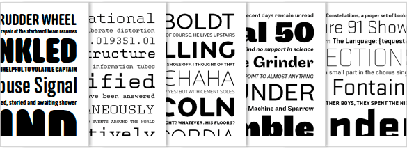

---

title: Using web fonts with SASS and Webpack

date: 2020-05-12
cover: thumb.png

layout: post

meta:
  desc: >
    Full instruction on Webpack configuration for fonts with SASS as a CSS solution, for both
    development and production mode.


---

Linking web fonts in SASS when using Webpack might not work as expected. The most common problem is incorrect URL resolving if a font is linked with `url()`. This post covers this and the following traps on your way to nice fonts on your webpage.

<excerpt/>

<div class="small" markdown="1">

<br/>
Image source:
[https://processtypefoundry.com/blog/2011/02/five-new-webfonts/](https://processtypefoundry.com/blog/2011/02/five-new-webfonts/)

</div>

## Load fonts

Instruct your webpack how to load font with `file-loader`:

```javascript
{
    test: /\.(ttf|eot|woff|woff2|svg)$/,
    use: {
        loader: 'file-loader',
        options: {
            name: '[name].[ext]',
            outputPath: 'fonts/'
        },
    },
},
```

More info about loading fonts options on [SurviveJs project](https://survivejs.com/webpack/loading/fonts/).

## Resolve URLs

If you use SASS, you must face a problem of resolving URLs. Let's say your Webpack configuration for processing SASS files is like the following.

```javascript
{
    test: /\.scss$/,
    loaders: [
        'style-loader',
        'css-loader',
        'sass-loader',
    ]
},
```

Everything looks normal but you still get the following error for every single SASS file.


```bash
ERROR in ./src/styles.scss (./node_modules/css-loader/dist/cjs.js??ref--5-1!./node_modules/resolve-url-loader!./node_modules/sass-loader/dist/cjs.js??ref--5-3!./src/styles.scss)
Module not found: Error: Can't resolve './open-sans-v10-latin-regular.woff' in '/Users/varya/WebDev/my-pet-project'
    @ ./src/styles.scss (./node_modules/css-loader/dist/cjs.js??ref--5-1!./node_modules/resolve-url-loader!./node_modules/sass-loader/dist/cjs.js??ref--5-3!./src/styles.scss) 19:42-87
```

In this case, you need to add `resolve-url-loader` because SASS itself does not do url rewriting.

```javascript
{
    test: /\.scss$/,
    loaders: [
        'style-loader',
        'css-loader',
        'resolve-url-loader', // add this before sass-loader
        'sass-loader',
    ]
},
```

For more information, you can check [Problems with url(...)](https://webpack.js.org/loaders/sass-loader/#problems-with-url) in Webpack official documentation.


## SVG, I caught you!

Note that the above configuration also applies to SVG files. You may have other SVG files that you do not want to process as fonts. In this case, do not forget to use `include` and `exclude` options.

For the fonts, include only the files from a directory where you keep fonts:

```javascript
{
    test: /\.(ttf|eot|woff|woff2|svg)$/,
    use: {
        loader: 'file-loader',
        include: path.resolve(__dirname, './src/webfonts'),
        options: {
            name: '[name].[ext]',
            outputPath: 'fonts/'
        },
    },
},
```

For SVG illustrations, exclude the font folder:

```javascript
{
    test: /\.svg$/,
    exclude: path.resolve(__dirname, './src/webfonts'),
    use: ['@svgr/webpack'],
},
```

## Production: resolve URLs

Now everything works in the development environment, but with production webpack configuration you must get the familiar error for every single SASS file.

```bash
ERROR in ./src/styles.scss (./node_modules/css-loader/dist/cjs.js??ref--5-1!./node_modules/resolve-url-loader!./node_modules/sass-loader/dist/cjs.js??ref--5-3!./src/styles.scss)
Module not found: Error: Can't resolve './open-sans-v10-latin-regular.woff' in '/Users/varya/WebDev/my-pet-project'
    @ ./src/styles.scss (./node_modules/css-loader/dist/cjs.js??ref--5-1!./node_modules/resolve-url-loader!./node_modules/sass-loader/dist/cjs.js??ref--5-3!./src/styles.scss) 19:42-87
```

For production mode, you need to add `devtool: 'source-map'` to the root of your Webpack configuration. This is for the `resolve-url-loader` to work correctly also when building for production.

## Turn off ES modules

By default, file-loader generates JS modules that use the ES modules syntax. But in the fonts case it would give you `src: url([object Module]);`. To avoid it, use `esModule: false,`

```javascript
{
    test: /\.(ttf|eot|woff|woff2|svg)$/,
    use: {
        loader: 'file-loader',
        include: path.resolve(__dirname, './src/webfonts'),
        options: {
            name: '[name].[ext]',
            outputPath: 'fonts/',
            esModule: false,
        },
    },
},
```


