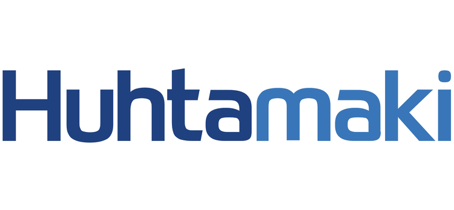
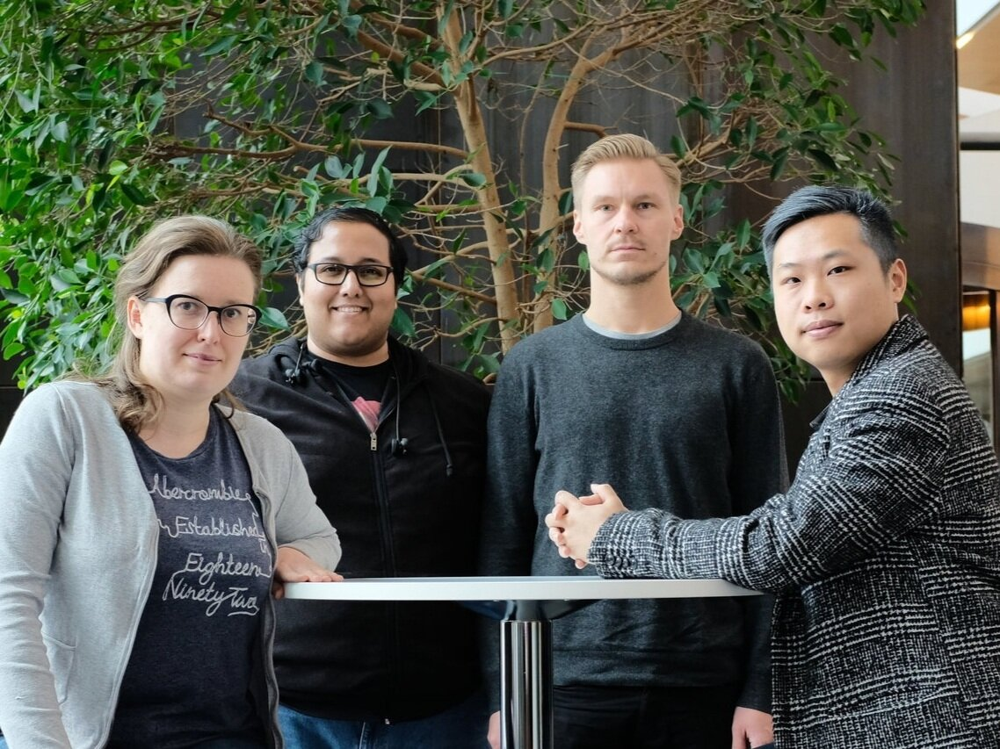
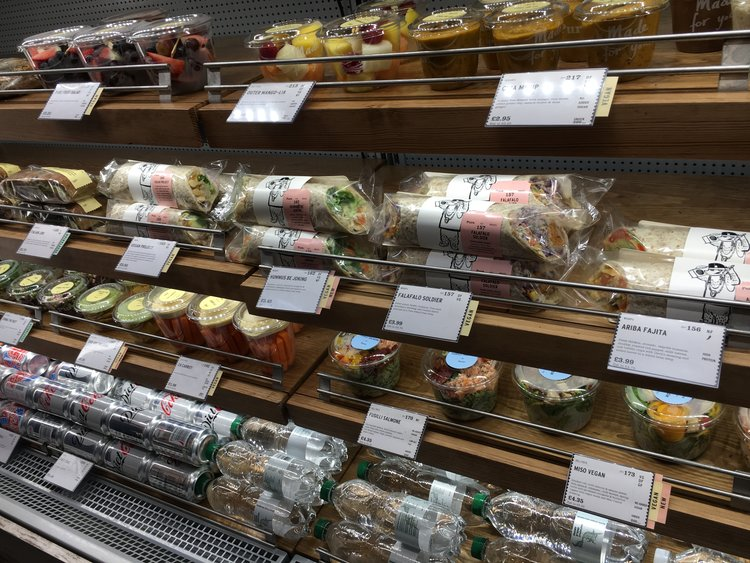
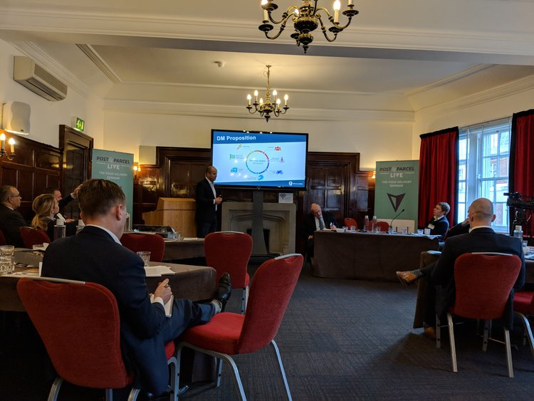
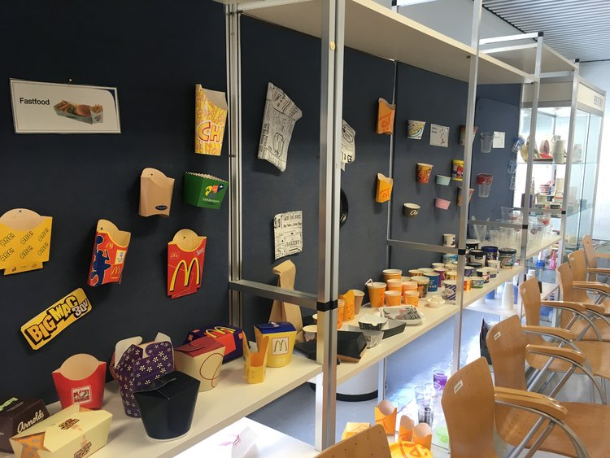
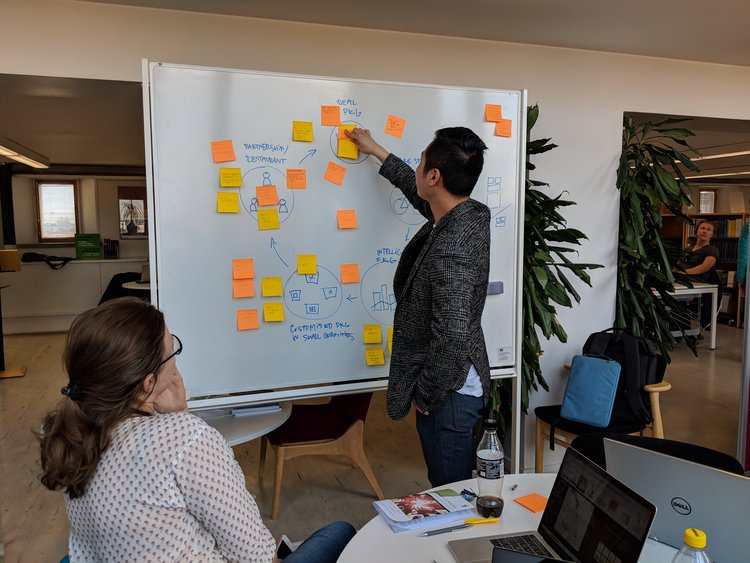
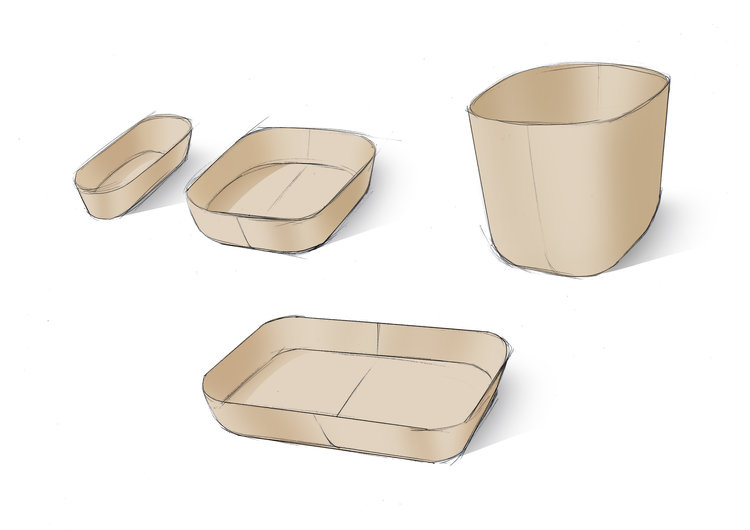
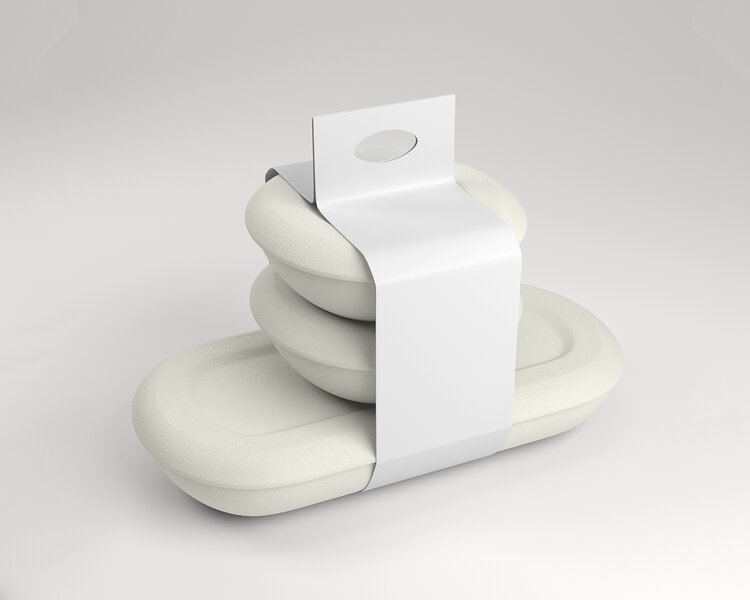
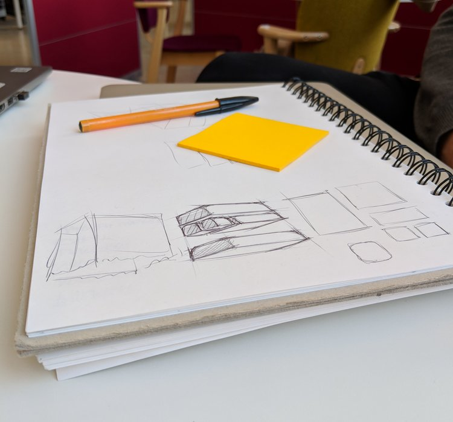
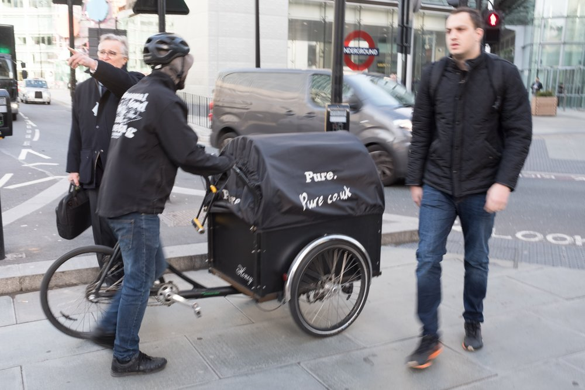

import image1 from "./packaging_flat.jpg";

This project was done during my master’s degree at Aalto, for the IDBM program’s Industry Project course. The clients, Huhtamaki, are global food packaging specialists, and were looking to enter the home delivery packaging space. However, this was a new space for them, so they needed our team to help them understand the home delivery space in order to produce an optimal packaging solution to maintain their strong position in the packaging domain.

Over the span of 6 months, our team did a deep dive into all the aspects of food delivery. Our research led us to conclude that a strategic solution was needed, not a product one. Thus we proceeded to craft an ecosystem map and based on what we learned from our research, created a road map of concepts to lead our clients to a systemic solution that could succeed within the rapidly growing home delivery space.

## Project Overview

<Box direction="row" gap="large">
<Box basis="1/2">

#### MY ROLE

In this project, I was involed into collecting and alalysing qualitative data, processing
the quantitative data, organising the industry research (including connection to the industry
top players). 
As an experienced public speaker, I conducted a full day workshop to sharpen the final
presentation of the project. 
From the technical perspective, I took the part of preparing a Huhtamaki internal website which
presented the results of both research and design phases of the project as well as an extensive
description of how the project was going.
</Box>
<Box basis="1/2">

#### WORK AND DELIVERABLES

- Domain and Future Trends Analysis
- Long Term Strategic Approach
- Extensive Research into User Behavior
- Competitive Benchmarking & Design Concept
- Design Workshops and Ideation
- Deep dive into client’s manufacturing capabilities and existing product pipeline

</Box>
</Box>

### The Team

<Image caption="From L to R - Varya Stepanova, Adithya Varadarajan, Juho Viironen, Jialai Qian. We were a wonderfully diverse and multidisciplinary team with a mix of backgrounds ranging from a design strategist to a packaging designer and a material science expert.">

</Image>

## Overall Process

<Box direction="row" gap="medium">
<Box flex={true}>

### Extensive Field Research to Understand Consumers

Our very first step was to understand the food consumer perspective on delivery and packaging. To do this, our team took a deep dive into delivery and takeaway food in London, Berlin and Helsinki. We studied different delivery companies, take out from restaurants and stores, and also the various packaging types on offer through observations, secondary research and video observations of the delivery process. We also conducted interviews, both in person and remote, with people from 30 different countries, ranging from India to Kenya to Japan to the USA.

This helped us to really understand their behavior and preferences around food delivery. We also did extensive observational research of restaurant and store takeaway practices to understand preferences and trends there as well. Lastly, we also had a chance to speak to operators in the food delivery services domain, to understand their perspective as well.

</Box>
<Box flex={{"grow": 1}}  margin={{top: "medium"}} pad="small">
<Image >

</Image>
</Box>
</Box>

<Box direction="row" gap="medium">
<Box flex={{"grow": 1}} margin={{top: "medium"}} pad="small">
<Image>

</Image>
</Box>
<Box  flex={true}>

### Conferences for a Deep Dive into the Delivery Industry

We understood that a successful solution would need a thorough understanding of the domain even beyond the consumer, and to enable this, we approached this three different perspectives: food delivery platform, food producer and packaging producer. We attended two conferences in London as well as a packaging seminar at Slush to understand more about the industry side. These were very useful to understand industry trends, as well as to identify potential strategic partners, depending on the solution.

These conferences also helped us get an understanding of what to expect from the home delivery space in the future, both short and medium term, while getting an idea of what the big players in the space were doing. These future trends really enhanced our understanding of what the domain needed.

</Box>
</Box>

<Box background="accent-50" pad="medium" textAlign="center" margin={{horizontal: "auto", vertica: "medium"}}>

#### UNDERSTANDING THE KEY PLAYERS DRIVING HOME DELIVERY

<Paragraph standout>Over the course of our research, a repeating theme that came up, was the growing presence of companies that specialized in providing delivery services as an external vendor for restaurants. This included companies like Uber Eats, Foodora, Deliveroo and more.</Paragraph>

<Paragraph standout>As we delved deeper into these companies, we realized how much their presence simplifies life for restaurants who want to get into delivery. Restaurants no longer have to invest in resources who can handle delivery for them, as these companies provide the logistics, the payment gateways and the delivery agents who handle the whole process, allowing restaurants to focus on what they do best - make food.</Paragraph>

<Paragraph standout>In addition, companies like Deliveroo, in order to ensure they maintained the optimal consumer experience which was a huge factor for their growth, were actually taking over the logistics of testing, procuring and supplying optimal packaging to the restaurants, thus becoming a one stop delivery enabler.</Paragraph>
</Box>

<Box direction="row" gap="medium">

<Box  flex={true}>

### Understanding Huhtamaki’s Capabilities on Site

We visited one of our client’s production facilities in Finland as well as a subsidiary office in India to get a better picture of where they stood in their ability to deliver optimal solutions for the delivery space.

This also helped us understand their current product offerings and the kind of customers they currently had. This allowed us to think of potential ways in which their existing technology and solutions could translate into the delivery space while also giving us a business perspective on their capabilities.

</Box>
<Box flex={{"grow": 1}} margin={{top: "medium"}} pad="small">
<Image>

</Image>
</Box>
</Box>

<Box background="accent-50" pad="medium" width="large" margin={{horizontal: "auto"}}>

#### BASED ON OUR RESEARCH, OUR APPROACH CHANGED

<Paragraph standout>The optimal solution wasn’t just about creating better packaging for home delivery as the client originally intended, it needed something much more comprehensive.</Paragraph>
</Box>

<Box direction="row" gap="medium">
<Box flex={{"grow": 1}} margin={{top: "medium"}} pad="small">
<Image>

</Image>
</Box>
<Box  flex={true}>

### Crafting a Future Focused Strategic Solution

Once we had this understanding, we put on our ideation hats with our clients on board. We first put together a clear picture of the entire delivery ecosystem that helped visualize all the potential touch points that could be influenced via a strategic solution. Then we crafted a multi-step concept road map which included elements from product design, service design, internet of things (IoT) and co-creation.

The intent of this roadmap was to provide a strategic approach for the client that ensured they weren’t just catching up or reacting to the current state of the domain, but rather aligning with trends and setting themselves up for sustainable, long term, success.

</Box>
</Box>

## Final Outcome

The final outcome - the detailed ecosystem, the long term solution roadmap and predictions on the future of food delivery - these are all protected by NDA with the client and cannot be shared. The gallery below features some elements of the process we took to get there and I’d be happy to discuss more about our thought process and rationale.

If you’d like to know more about the project, get in touch! You can also check out the following features about our project as well.

<Box direction="row" gap="medium" justify="around" direction="row" background="light-2" pad="xlarge" >

<Button primary href="https://www.huhtamaki.com/en/highlights/recent/understanding-food-delivery-on-a-local-level/" label="Huhtamaki Article"/>
<Button primary href="https://www.idbm.aalto.fi/industry-projects/2018/5/31/huhtamaki-idbm" label="IDBM Impact Feature"/>
</Box>

<Image>

</Image>

<Image>

</Image>

<Box direction="row" height="small">
<Box flex={true}>
<Image>

</Image>
</Box>

<Box flex="true">
<Image>

</Image>
</Box>

<Box flex="true">
<Image>

</Image>
</Box>

</Box>

The description is made by the project teammate [Adithya Varadarajan](https://www.adithyadesign.com/work/delivery-packaging).
